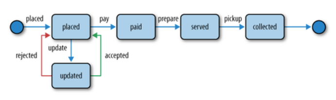

# CMPE281 Team Hackathon - Tenant API Back-End

This repository is team hackathon project for CMPE281 at San Jose State Univeristy lecturered by [Paul Nguyen](https://github.com/paulnguyen). The repository only includes a REST API which only a portion of the team hackathon porject that has to be done by each team member. This back-end REST API is developed based on how Starbucks App process each order as shown below.

The language/technology used:

- Python/Flask

- Amazon Dynamo
